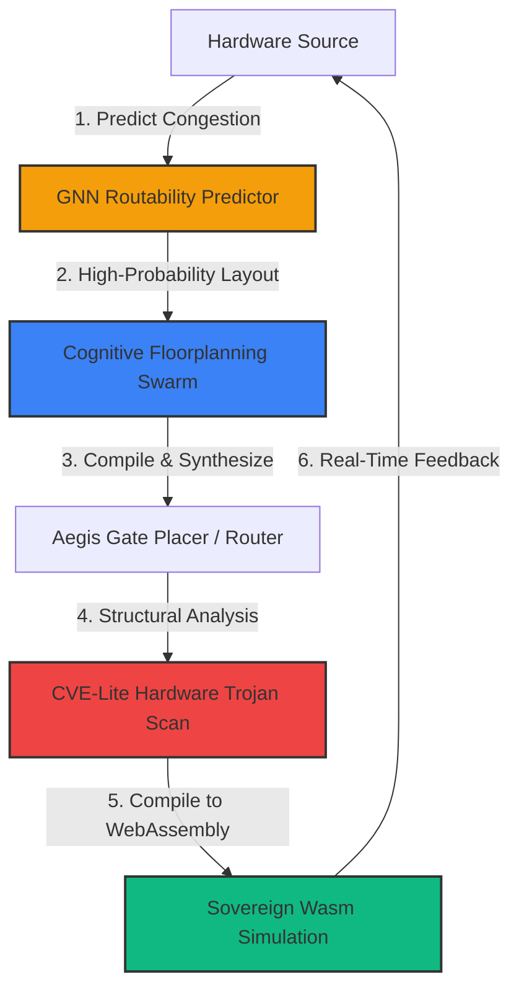

# 🏛️ AGE REPUBLIC :: HARDWARE INTERACTION BLUEPRINT
## Brainstorming & Architectural Roadmap: Advanced Refinements & Future Milestones for Aegis Gate

This manifest outlines visionary systems-engineering concepts and advanced refinements designed to push **Aegis Gate** to the absolute forefront of modern hardware synthesis, establishing it as a highly automated, self-correcting, and secure open-source compiler ecosystem.

---

---

## 💡 Concept I: Graph Neural Network Routability & Timing Predictor (GNN-Route)
*   **The Problem**: Place-and-route is an expensive iterative process. Traditional compilers only discover timing failures or unroutable congestion late in the physical mapping phase.
*   **The Refinement**:
    1.  We integrate a lightweight **Graph Neural Network (GNN)** directly into the Aegis synthesis front-end.
    2.  The netlist is modeled as a directed graph. The GNN is trained on historical open-source routing maps to predict physical routing congestion and setup/hold timing slack *before* a single coordinate is placed.
    3.  Aegis Gate instantly flags unroutable designs in **under 200 milliseconds**, saving hours of unnecessary placer iterations and enabling real-time feedback during hardware description writing.

---

## 💡 Concept II: Autonomous Floorplanning Swarms
*   **The Problem**: Large FPGA designs require human engineers to spend days dividing the silicon die into floorplanned partitions (pblocks) to ensure modular compile speeds and timing closure.
*   **The Refinement**:
    1.  Aegis Gate integrates a **decentralized cognitive agent swarm** (using tool-calling enclaves and long-context reasoning).
    2.  The swarm analyzes the global design architecture, automatically partitions it into isolated physical boundaries, and tests thousands of floorplanning variations in parallel.
    3.  By evaluating resource utilization (LUTs, BRAMs, DSPs) and clock tree latency across multiple iterations, the swarm converges on the mathematically optimal physical layout, saving weeks of manual human layout work.

---

## 💡 Concept III: CVE-Lite Hardware Trojan & Bitstream Auditor
*   **The Problem**: Closed-source vendor bitstream generators represent a severe security risk, as malicious logic, backdoors, or hardware Trojans can be injected directly into the output binary without detection.
*   **The Refinement**:
    1.  Aegis Gate implements an integrated structural auditing module within the bitstream assembly step.
    2.  The auditor parses the synthesized logical netlist against an open-source catalog of hardware Trojan patterns, checking for unauthorized clock domains, hidden activation counters, or illegal multiplexer bypasses.
    3.  It enforces **strict boundary verification** to guarantee that secure enclaves (e.g. the Zcash Shielded Treasury module or payment rails) remain physically isolated from public communication busses, attesting bitstream integrity at the gate level.

---

## 💡 Concept IV: WebAssembly-Based Simulation Enclaves (Aegis Wasm-Sim)
*   **The Problem**: Verifying FPGA designs traditionally requires installing heavy, platform-specific desktop simulator suites (e.g. ModelSim, Verilator) and maintaining complex local system dependencies.
*   **The Refinement**:
    1.  We implement an automated compile-to-simulation pipeline that translates SystemVerilog or Rust designs into high-throughput **WebAssembly (Wasm)** binaries.
    2.  These Wasm simulation models run directly inside the Glance-based self-hosted Aegis Web Cockpit, executing at native CPU speeds inside a completely sandboxed browser environment.
    3.  Engineers can inspect gate states, view waveform charts, and debug hardware pipelines directly inside their web browser with **zero local software dependencies.**

---

## 💡 Concept V: USB4STREAM Remote Compilation Swarms
*   **The Problem**: Compiling large designs requires substantial local GPU and CPU resources, causing laptop thermal throttling during off-grid operations.
*   **The Refinement**:
    1.  Aegis Gate implements a highly secure, high-speed remote compilation pipeline.
    2.  Lightweight front-end parsing, GNN analysis, and code linting occur locally on the engineer's workspace.
    3.  The intermediate representation is tunneled over **USB4STREAM** ConfigFS bridges at **40-80 Gbps** to a high-power sovereign compilation server equipped with large GPU arrays, which performs the heavy placement calculations.
    4.  The server streams the completed, signed bitstream back over Thunderbolt, loading it directly into the target FPGA fabric in milliseconds.

---

## 🏛️ Refinement Implementation Action Plan

To transition these visionary concepts into the active Aegis Gate roadmap:

| Phase | Milestone | Technical Target | expected Timing |
| :--- | :--- | :--- | :---: |
| **Phase I** | Aegis Wasm-Sim MVP | Embed a WebAssembly-compiled Verilator simulation runner inside the self-hosted Glance dashboard. | **1 month** |
| **Phase II** | GNN Integration | Train a GNN model on open-source XC7Z020 routing databases and integrate it as a fast-path linter. | **3 months** |
| **Phase III** | Bitstream Auditor | Write structural verification rules to scan output SystemVerilog netlists for physical enclave boundaries. | **2 months** |
