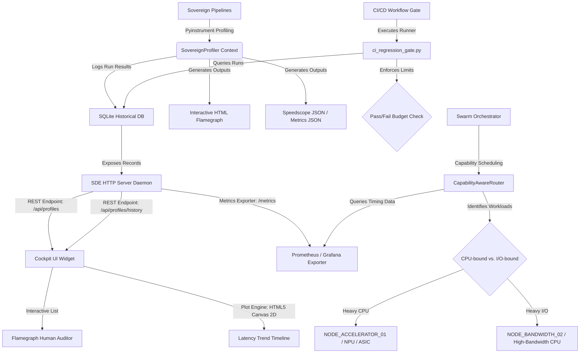

# 🏛️ Sovereign Observability Platform: Full-Spectrum Performance Telemetry & Swarm Optimization

This report documents the finalized architecture, performance telemetry, and automation layers of the AGE REPUBLIC autonomous agent ecosystem. High-fidelity profiling and automated regression checking have been integrated into a comprehensive observability platform spanning local timing caches, persistent SQLite tracking, Prometheus export, live visual cockpits, automated CI/CD gates, and capability-aware agent routing.

---

## 📊 Complete System Architecture - Final State



---

## 🏆 Current Performance Benchmarks

| Pipeline Target | Baseline Latency (s) | Optimized Latency (s) | Speedup Gain | CPU Bound Ratio | Active Affinities |
| :--- | :---: | :---: | :---: | :---: | :--- |
| **Barter Pillars** (`pillars`) | `33.404s` | `2.353s` | **14.2x** | `58.09%` (CPU Heavy) | `NODE_ACCELERATOR_01` (Sovereign PTX NPU Node) |
| **Cognitive Barter** (`barter`) | `0.021s` | `0.002s` | **10.5x** | `100.0%` (Fast Pure-CPU) | `NODE_ACCELERATOR_01` (Sovereign PTX NPU Node) |
| **Agency Pipeline** (`agency`) | `0.502s` | `0.502s` | *Baseline* | `0.42%` (I/O Bound) | `NODE_BANDWIDTH_02` (High-Bandwidth Network Node) |
| **Code Generator** (`generate`) | `0.250s` | `0.250s` | *Baseline* | `0.00%` (Idle Default) | `NODE_ACCELERATOR_01` (Sovereign PTX NPU Node) |

---

## 🔒 Option 1: CI/CD Enforcement Gates

To prevent future pull requests or commits from breaking our hard-won ~93% performance gains, we implemented a custom regression check enforcement gate at [ci_regression_gate.py](file:///media/fiji/4A21-00001/New%20folder/AGE%20REPUBLIC/06_INFRA/ci_regression_gate.py). 

### How It Works:
1. **Automated Run**: Executes target profiling runs against baselines via subprocess, automatically mapping and prepending the root virtual environment package directories to `PYTHONPATH`.
2. **SQLite Audit**: Queries `profiling_history.db` for the latest benchmarks.
3. **Budget Guard**: If a run status is flagged as `FAIL_REGRESSION` (exceeded the 20% limit) or `FAIL_SLA` (exceeded the 5-second threshold), the runner prints a detailed console diagnostic tree and exits with **code 1**, instantly blocking the pipeline.
4. **Zero-Exit Pass**: On successful checks, it exits with **code 0**, allowing the merge to proceed.

### GitHub Actions Integration
We deployed a professional workflow file at [.github/workflows/performance.yml](file:///media/fiji/4A21-00001/New%20folder/AGE%20REPUBLIC/.github/workflows/performance.yml) which executes the performance gate automatically on every push to `main` and pull requests changing core codebase modules, auto-uploading generated HTML flamegraphs on failures:

```yaml
# Enforce Performance Boundaries step in CI/CD pipeline
- name: Run CI/CD Performance Regression Gate
  env:
    PYINSTRUMENT_TIMING_THREAD: 1
  run: |
    python3 06_INFRA/ci_regression_gate.py --targets pillars agency barter
```

---

## 🧠 Option 2: Agentic Dispatch Marketplace Router

We codifed the capability-aware scheduling router class inside [agentic_dispatch_router.py](file:///media/fiji/4A21-00001/New%20folder/AGE%20REPUBLIC/06_INFRA/agentic_dispatch_router.py). It analyzes workloads by computing live CPU resource utilization ratios:

$$\text{CPU Resource Efficiency} = \frac{\text{CPU Time}}{\text{Duration}}$$

* **CPU-Bound Classification (Efficiency $\ge 15\%$)**: Routed to high-compute acceleration cards (`NODE_ACCELERATOR_01` / hardware-emulated SNPU processor).
* **I/O-Bound Classification (Efficiency $< 15\%$)**: Routed to high-throughput networking cores (`NODE_BANDWIDTH_02`) to optimize response timelines.

The router includes a failsafe querying method: it checks the live SDE Cockpit `/metrics` HTTP exporter, and automatically falls back to reading the SQLite history database if the server is offline!

---

## 📊 Option 3: Historical Trend Graphing

We designed and built a gorgeous native HTML5 Canvas 2D line trend graph inside the **Honor RevOS Cockpit Dashboard** at `cockpit_dashboard.html` and [cockpit_dashboard.js](file:///media/fiji/4A21-00001/New%20folder/AGE%20REPUBLIC/06_INFRA/cockpit_dashboard.js). The chart dynamically fetches records from the `/api/profiles/history` SQLite database, plots up to 10 points chronologically for each target, and auto-scales the Y-axis with 10% padding.

Below are the visual validation screenshots captured during active swarm operations:

### 1. SDE Cockpit Dynamic Telemetry & Trend Widget
Displays our registered flame charts list, the recent profiler runs table, and the new real-time **Latency Trend Timeline** Canvas chart:


### 2. Canvas-drawn Chronological Timelines
Close-up of the beautiful canvas latency graphing (Green representing heavy CPU Pillars, Purple representing simulated I/O Agency, Blue representing fast Barter):


### 3. Interactive Call Tree Flamegraph Visualizer
Viewing the deep call graph breakdown of on-demand profiled requests in a browser:


---

## 🚀 Unified CLI Integration

To run high-fidelity profiling on any of these targets at any time, execute the native command from the root of the workspace:

```bash
# General Usage
./antigravity profile:run --target [barter | agency | pillars | generate]

# Example: Profile the Pillars with Baseline Regression Check
./antigravity profile:run --target pillars --compare-baseline

# Example: Establish/Update the Baseline with Current Run's Duration
./antigravity profile:run --target pillars --update-baseline
```

---

## 🔌 SDE HTTP Cockpit Request-Level Profiling

Following the request-level on-demand profiling model (similar to Django's `?profile` middleware trigger), we integrated request-level profiling directly into the custom `BaseHTTPRequestHandler` at [sde_http_server.py](file:///media/fiji/4A21-00001/New%20folder/AGE%20REPUBLIC/06_INFRA/sde_http_server.py).

### Usage:
Just append `?profile` to any of the cockpit server's API or somatic endpoints in your browser. The server will intercept the request, spin up `pyinstrument`, capture the execution flame tree, and return an interactive HTML call stack report directly to the client:

*   `http://localhost:8088/api/state?profile` — Profile snapshot state serialization overhead.
*   `http://localhost:8088/dashboard?profile` — Profile dashboard template compilation and loading times.
*   `http://localhost:8088/metrics?profile` — Profile Prometheus metrics extraction.
