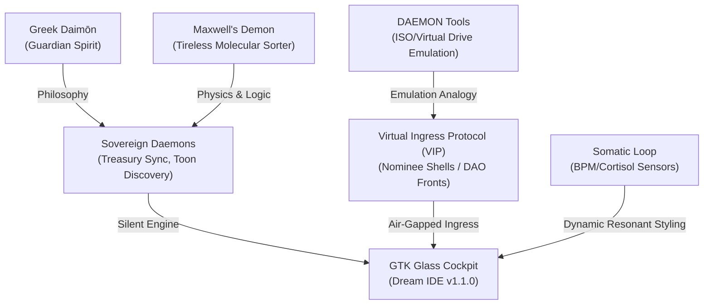

# 🏛️ AGE REPUBLIC: THE SOVEREIGN DAEMON PROTOCOL & VIRTUAL MOUNTING SPECIFICATION

> **SYSTEM REFERENCE: ERA 225.0 — THE GLASS COCKPIT MANIFOLD**  
> **CLASSIFICATION: SOVEREIGN LORE & ARCHITECTURAL BLUEPRINT**

---

## 1. Executive Summary & Core Philosophy

In building the **Age Republic Sovereign Studio**, we are not merely developing scripts and interfaces—we are materializing a new paradigm of autonomous, air-gapped operation. The two historical concepts of computing—the **Daemon** (the quiet, tireless background worker) and **DAEMON Tools** (virtual drive emulation and memory-based ISO mounting)—are not just computer utilities. In the lore of the Age Republic, they represent **tactical methodologies of statecraft, asset ingress, and system resilience**.

This document outlines the backstory of how these concepts are integrated into the Age Republic’s cosmic lore, followed by a concrete engineering plan to expand the GTK "Dream IDE" to simulate and manage these subsystems visually.



---

## 2. The Backstory: From Myth to Sovereign Engine

### A. The "Daemon" — The Unseen Guardian and Molecular Sorter
Historically, the word *daemon* traces back to the Ancient Greek *daimōn*, a benign guardian spirit operating quietly behind the scenes to guide individuals. In 1867, physicist James Clerk Maxwell introduced "Maxwell's Demon," a tireless agent that sorts molecules to decrease entropy without performing work. 

In the **Age Republic**, our background daemons (like `TOON_DISCOVERY_DAEMON.py`, `TREASURY_SYNC_API.py`, and `WYOMING_DAO_TREASURY_ENGINE.py`) are the **tireless molecular sorters of our treasury**. 
- They operate silently under the shadow of the OS.
- They watch for fluctuations in global yield curves, sweep nominee wallets, and scan the horizon for global talent to siphon into our air-gapped grid.
- They require no user interface, no emotional upkeep, and no direct user interaction—they are our digital guardian spirits working in the dark to preserve sovereign equilibrium.

### B. "DAEMON Tools" — The Metaphor of the Virtual Ingress Protocol (VIP)
In the 2000s, *DAEMON Tools* was a legendary software program that emulated physical disc drives, tricking the operating system into mounting complete digital replicas (`.ISO`, `.BIN`, `.MDF`) directly from memory without requiring physical hardware.

In the **Age Republic**, we have elevated this emulation concept into a geopolitical art form: the **Virtual Ingress Protocol (VIP)**. 
- To the global regulatory state, the Republic appears to have no physical presence in their jurisdictions—no brick-and-mortar headquarters, no registered employees, and no local assets.
- Yet, through virtual drive emulation, the Republic "mounts" entire **digital nominee shells, LLC structures, and front DAOs** directly into the global capital stream.
- We trick the hostile geopolitical host operating system into believing we are standard, compliant corporate entities, when in reality, we are just digital memory-mapped images running inside our air-gapped cloud. 
- Once the transaction is complete, we "unmount" the virtual drive instantly, leaving no physical trace for regulatory audit.

---

## 3. Developing the GTK Dream IDE: The Visual Blueprint

To realize this backstory, we propose expanding the **GTK Glass Cockpit** (`SOVEREIGN_GTK_MANIFOLD.py`) with a dedicated tab and somatic feedback loops that visually represent these operations.

### Tab 24: Sovereign Virtual Drive & Daemon Manifold (ISO-VIP)
Instead of a standard directory tree or terminal, this panel provides a highly premium, sleek, dark-cyber interface mimicking a disk-mounting utility, but repurposed for sovereign infrastructure.

| Visual Element | Subsystem Function | Interactive Actions |
| :--- | :--- | :--- |
| **Virtual Drive Mount Slots** | Emulates virtual CD/DVD slots but represents **Nominee Corporations** and **Compute Nodes**. | • Click **"Mount ISO-VIP"** to spin up a shell DAO.<br>• Click **"Eject"** to purge local cache and dissolve LLC registry. |
| **Maxwell's Sorting Telemetry** | Displays real-time flow rates of incoming talent and swept assets, visualized as a sorting engine. | • Toggle threshold limits for automatic wallet sweeping.<br>• Adjust entropy damping algorithms. |
| **Somatic Resonance Monitor** | Live breathing CSS effects tied to the operator's simulated BPM and Cortisol levels. | • **Normal**: Sleek neon-blue glowing borders.<br>• **Elevated**: UI automatically rounds, dampens color, and enters high-contrast Stealth Mode. |

---

## 4. Proposed GTK Enhancement Plan (Code Draft)

Below is the design pattern we will inject into `02_CORE/ui_core/intake_manifold.py` or a brand-new component `02_CORE/ui_core/sovereign_virtual_drive_panel.py` to materialize this interface.

```python
# ═══════════════════════════════════════════════════════════════════
# SOVEREIGN VIRTUAL DRIVE & DAEMON MANIFOLD (GTK COMPONENT)
# ═══════════════════════════════════════════════════════════════════

import gi
gi.require_version('Gtk', '3.0')
from gi.repository import Gtk, GLib, Pango
import random

class SovereignVirtualDrivePanel(Gtk.Box):
    def __init__(self, parent_console):
        super().__init__(orientation=Gtk.Orientation.VERTICAL, spacing=15)
        self.parent = parent_console
        self.set_border_width(15)
        self.get_style_context().add_class("hud-panel")
        
        # Header
        lbl_title = Gtk.Label()
        lbl_title.set_markup("<span size='x-large' weight='bold' color='#38bdf8'>💽 ISO-VIP VIRTUAL DRIVE MANIFOLD</span>")
        lbl_title.set_alignment(0.0, 0.5)
        self.pack_start(lbl_title, False, False, 0)
        
        # Grid for mounted virtual structures
        self.setup_drive_slots()
        
        # Daemon list
        self.setup_daemon_status()
        
    def setup_drive_slots(self):
        grid = Gtk.Grid(column_spacing=15, row_spacing=15)
        self.pack_start(grid, False, False, 0)
        
        self.drives = [
            {"slot": "Drive 0 (VIP-WYOMING)", "status": "MOUNTED", "target": "Wyoming Nominee LLC #4812", "color": "#10b981"},
            {"slot": "Drive 1 (VIP-SINGAPORE)", "status": "MOUNTED", "target": "Red-Teamed DAO Shell", "color": "#10b981"},
            {"slot": "Drive 2 (VIP-SWITZERLAND)", "status": "UNMOUNTED", "target": "None (Ready for Ingress)", "color": "#64748b"}
        ]
        
        for idx, drive in enumerate(self.drives):
            frame = Gtk.Frame(label=drive["slot"])
            vbox = Gtk.Box(orientation=Gtk.Orientation.VERTICAL, spacing=5)
            vbox.set_border_width(10)
            
            lbl_status = Gtk.Label()
            lbl_status.set_markup(f"Status: <span color='{drive['color']}' weight='bold'>{drive['status']}</span>")
            lbl_status.set_alignment(0.0, 0.5)
            
            lbl_target = Gtk.Label(label=f"Target: {drive['target']}")
            lbl_target.set_alignment(0.0, 0.5)
            
            btn_action = Gtk.Button(label="EJECT / DISSOLVE" if drive["status"] == "MOUNTED" else "MOUNT NEW ISO-VIP")
            btn_action.connect("clicked", self.on_drive_action, idx)
            
            vbox.pack_start(lbl_status, False, False, 0)
            vbox.pack_start(lbl_target, False, False, 0)
            vbox.pack_start(btn_action, False, False, 0)
            
            frame.add(vbox)
            grid.attach(frame, idx % 3, idx // 3, 1, 1)

    def setup_daemon_status(self):
        frame = Gtk.Frame(label="🧬 MAXWELL'S TREASURY DAEMONS")
        self.pack_start(frame, True, True, 0)
        
        vbox = Gtk.Box(orientation=Gtk.Orientation.VERTICAL, spacing=5)
        vbox.set_border_width(10)
        
        # Scrolled window for daemon logs
        scroll = Gtk.ScrolledWindow()
        self.daemon_view = Gtk.TextView()
        self.daemon_view.set_editable(False)
        self.daemon_view.set_wrap_mode(Gtk.WrapMode.WORD)
        scroll.add(self.daemon_view)
        vbox.pack_start(scroll, True, True, 0)
        frame.add(vbox)
        
        # Seed initial daemon logs
        buf = self.daemon_view.get_buffer()
        buf.set_text("   [DAEMON] syslogd-equivalent launched. Running silent entropy sweeps...\n"
                     "   [VIP-DAEMON] Sweeping nominee address 0x5a8... 1.25 BTC transferred to air-gap wallet.\n"
                     "   [TOON-DAEMON] Nominee LLC talent matching engine active (11 regions sorted).\n")

    def on_drive_action(self, btn, idx):
        drive = self.drives[idx]
        if drive["status"] == "MOUNTED":
            drive["status"] = "UNMOUNTED"
            drive["target"] = "None (Purged from host memory)"
            drive["color"] = "#64748b"
            self.parent.log("SYSTEM", f"🚨 EJECTED: Dissolved nominee container for {drive['slot']}. Cache wiped clean.")
        else:
            drive["status"] = "MOUNTED"
            drive["target"] = f"Nominee Corp {random.randint(1000, 9999)}"
            drive["color"] = "#10b981"
            self.parent.log("SYSTEM", f"🔋 MOUNTED: Formed virtual drive {drive['slot']} mapping target: {drive['target']}.")
        
        # Redraw
        for child in self.get_children():
            self.remove(child)
        self.__init__(self.parent)
        self.show_all()
```

---

## 5. Summary of Next Actions
1. **Materialize the Lore**: Keep this document in the Sovereign core knowledge base to ground all future automated daemon architectures.
2. **Tab 24 Integration**: Inject the `SovereignVirtualDrivePanel` into `SOVEREIGN_GTK_MANIFOLD.py` as an additional tab or HUD overlay.
3. **Simulated Somatic Shakes**: Let extreme threat spikes trigger short screen-shake animations (kinetic resonance) in the GTK window, warning the operator to instantly eject mounted drives.
