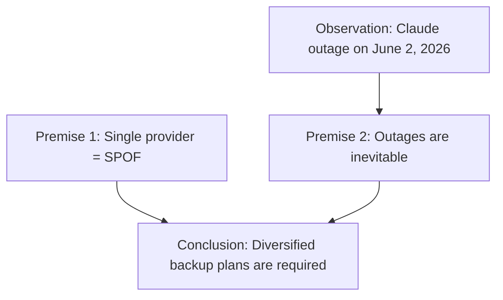

# Argument: Systemic Vulnerability in AI Dependency

## Metadata
- **Type:** Risk Mitigation Argument
- **Source:** Claude outage analysis (June 2, 2026)
- **Status:** Formalized

## Formal Logic Notation

```
P1: If a workflow relies exclusively on a single LLM provider (S), it has a single point of failure (F).
P2: If a workflow has a single point of failure (F), it is vulnerable to platform-specific outages (V).
P3: Platform-specific outages are inevitable (I → V).

∴ C: To mitigate operational risk, workflows must diversify LLM providers (¬S).
```

## Premises

| ID | Premise | Evidence |
|----|---------|----------|
| P1 | Exclusive reliance on one provider creates SPOF | Claude outage halted all users with no fallback |
| P2 | SPOF implies vulnerability to outages | Users unable to complete AI-dependent tasks |
| P3 | Outages are inevitable across providers | Prior ChatGPT, now Claude outages documented |

## Conclusion
Diversified backup plans are required to mitigate operational risks in AI-dependent workflows.

## Argument Map (Mermaid)



## Practical Implication
Maintain at least two independent AI providers (e.g., Anthropic + local LFM) and implement automatic failover.

## Tags
`#ai-governance` `#risk-mitigation` `#system-design` `#spof`
