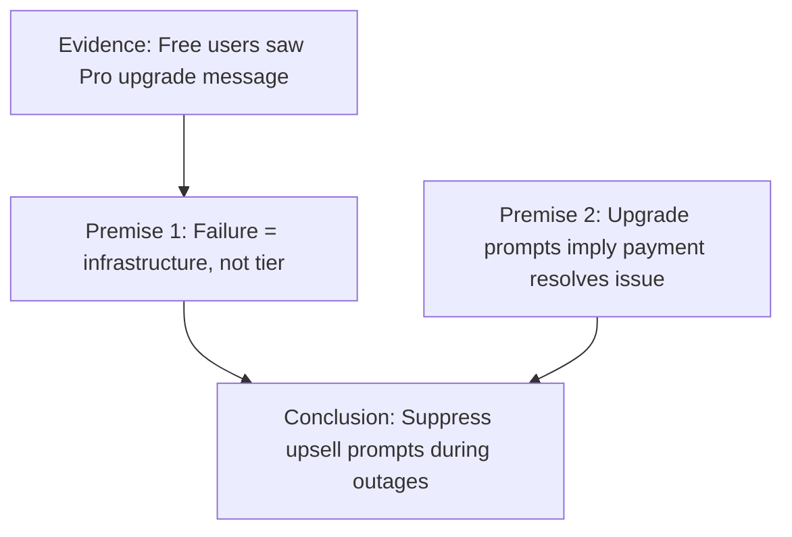

# Argument: Inappropriate Upselling During Service Disruption

## Metadata
- **Type:** Ethics / UX Design Argument
- **Source:** Claude outage analysis (June 2, 2026)
- **Status:** Formalized

## Formal Logic Notation

```
P1: The service failure was due to infrastructure issues (I), not user tier constraints (¬T).
P2: Prompts encouraging upgrades (U) imply that paying resolves the issue (T).
P3: Implying that paying resolves an infrastructure issue (U ∧ I ∧ ¬T) is exploitative/misleading (E).

∴ C: Upgrade prompts must not be displayed during confirmed infrastructure outages (¬U during I).
```

## Premises

| ID | Premise | Evidence |
|----|---------|----------|
| P1 | Failure root cause = infrastructure, not user tier | Anthropic status page: "elevated errors on Opus 4.6" |
| P2 | Upgrade prompts implicitly claim payment would help | Free tier message: "upgrade to Pro plan" |
| P3 | Such implication during infrastructure failure is misleading | No paid plan would resolve capacity constraints |

## Conclusion
Providers must suppress upsell prompts during confirmed infrastructure outages and instead display accurate technical status.

## Argument Map (Mermaid)



## Design Recommendation
Implement a status-aware UI rule:  
`IF outage_detected = true THEN suppress_all_upgrade_cta()`

## Tags
`#ai-governance` `#ux-ethics` `#incident-response` `#user-communication`
