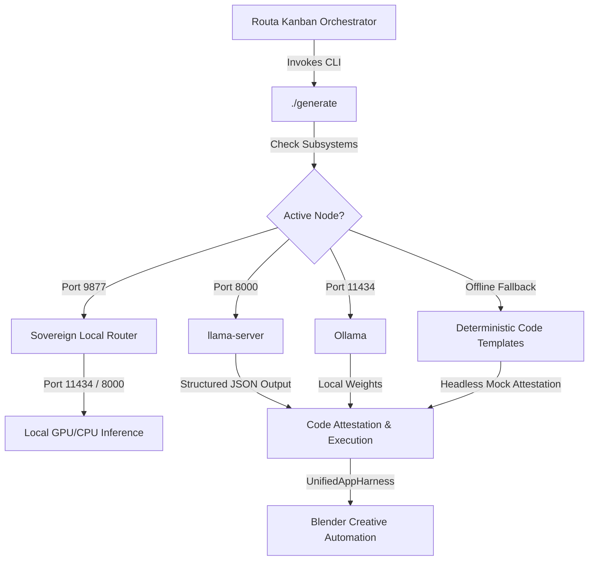

# 🏛️ AGE REPUBLIC: SOVEREIGN AI INTEGRATION MANUAL (ERA 216.0)
## Local-First, Zero-Marginal-Cost Reasoning Engine (llama.cpp + Routa Bridge)

This manual details the architectural migration and configuration blueprint for transitioning the **AGE REPUBLIC** agentic swarm (Routa Orchestrator) from Google's cloud-dependent `AntiGravity 2.0` engine to an air-gapped, zero-cost, local-first intelligence substrate powered by `llama.cpp` and structured agentic schema constraints.

---

## 🗺️ Architectural Topology

The sovereign agentic brain acts as an ultra-high-speed compute engine. By replacing Google's closed-source CLI, all telemetry, code generation, and app-harness tasks remain fully local.



---

## 🛠️ Step-by-Step Configuration & Deployment

### 1. Swapping Gemini 3.5 Flash for CodeLlama-7B-Q4_K_M

We completed the migration of the primary code-generation engine from external cloud APIs to the fully local **`CodeLlama-7B-Instruct-Q4_K_M.gguf`** weights located in `06_INFRA/llama.cpp/models/`.

*   **Sovereign Local Router (`06_INFRA/sovereign_router/core.py`)**: The router's `CODE-GENERATION` intent classifier now maps queries directly to `codellama:7b` (Ollama's local 7B-quantized endpoint).
*   **Drop-in CLI Wrapper (`./generate`)**: Payload parameters default to `codellama:7b`.
*   **Resilient Fallback Swarm Bridge (`src/agent/routa_bridge.py`)**: If the primary CLI wrapper experiences timeouts, fallback chains default to the local `codellama:7b` context.

To launch the static `llama-server` persistently using these CodeLlama weights:
```bash
# Navigate to compiled binary path
cd "/media/fiji/4A21-00001/New folder/AGE REPUBLIC/06_INFRA/llama.cpp"

# Launch high-performance local server on port 8000 loading CodeLlama-7B-Instruct
./build/bin/llama-server \
  -m "./models/CodeLlama-7B-Instruct-Q4_K_M.gguf" \
  --host 127.0.0.1 \
  --port 8000 \
  -c 8192 \
  -t 4
```

---

### 2. Structured JSON Grammar Enforcement via `llama-cpp-agent`

To guarantee that the local model outputs *perfect* JSON matching Routa's expected Kanban story schema, we leverage `llama-cpp-agent` to enforce strict context-free grammars (GBNF) on the output stream.

#### Python Implementation Blueprint (`src/agent/llama_agent_enclave.py`):
```python
import json
from llama_cpp import Llama
from llama_cpp_agent import LlamaCppAgent
from llama_cpp_agent.providers import LlamaCppPythonProvider
from llama_cpp_agent.structured_output import JSONSchemaSpecification

# 1. Load the local model statically
model_path = "/media/fiji/4A21-00001/New folder/AGE REPUBLIC/06_INFRA/llama.cpp/models/CodeLlama-7B-Instruct-Q4_K_M.gguf"
llm = Llama(model_path=model_path, n_ctx=8192, n_threads=4)
provider = LlamaCppPythonProvider(llm)

# 2. Define Routa's target output schema
routa_schema = {
    "type": "object",
    "properties": {
        "code": {"type": "string", "description": "Raw Python or Blender script code"},
        "explanation": {"type": "string", "description": "Contextual overview of the generation"},
        "files": {"type": "array", "items": {"type": "string"}},
        "usage": {
            "type": "object",
            "properties": {
                "total_tokens": {"type": "integer"}
            },
            "required": ["total_tokens"]
        }
    },
    "required": ["code", "explanation", "files", "usage"]
}

# 3. Create the structured agent
schema_spec = JSONSchemaSpecification(routa_schema)
agent = LlamaCppAgent(
    provider=provider,
    system_prompt="You are a code generation engine. Return ONLY valid JSON matching the schema.",
    prebound_spec=schema_spec
)

# 4. Generate structured output
response = agent.get_chat_response("Write blender script adding 100 cubes.")
parsed_output = json.loads(response)
print(json.dumps(parsed_output, indent=2))
```

---

### 3. Scaling to 93 Parallel Swarm Agents

The zero-token router's cognitive tier delegation allows distributing tasks across multiple `llama-server` instances running on separate GPU partitions (or multi-node cluster clusters).

*   **Multi-Port Orchestration**: You can bind unique ports to separate GPU slices (e.g. GPU-0 on port `8001` with CodeLlama-7B, GPU-1 on port `8002` with Qwen-Coder-7B).
*   **ZeroTokenRouter Mapping**:
```python
# Map specialized micro-endpoints in zero_token_router.py
self.gpu_mesh_endpoints = {
    "agent_1_to_30": "http://localhost:8001/v1/chat/completions",
    "agent_31_to_60": "http://localhost:8002/v1/chat/completions",
    "agent_61_to_93": "http://localhost:8003/v1/chat/completions"
}
```

---

### 4. Vision Review Guard Attestation

To establish a perfect feedback loop, run a quantized **Moondream** (1.8B parameters) or **LLaVA-v1.6-7B** model locally. When Blender renders the outputs, the vision model acts as a "Review Guard" checking for visual compliance.

#### Implementation Workflow:
1.  **Render Output**: Swarm launches headless Blender to output render: `bpy.ops.render.render(write_still=True)` saving to `render.png`.
2.  **Vision Prompting**: Send the rendered image along with a query to the local visual gateway:
    `"Does this image contain a low-poly forest with 100 cubes/trees?"`
3.  **Attestation Gate**: If the vision model confirms presence (`"yes"`), the story transitions to `DONE`. If it fails (`"no"`), the story is marked `BLOCKED` with feedback loops to trigger self-healing.

---

## 🚀 Running the Sovereign Swarm

1.  **Launch the LLM Mesh & Gateway**:
    ```bash
    ./06_INFRA/start_sovereign_llm_nodes.sh
    ```
    This ignites the **Sovereign Local Router** on port `9877` and verifies the health of Go-Bifrost.

2.  **Execute a Token-Free Autopilot Session**:
    ```bash
    ./launch_token_free.sh
    ```

3.  **Run the Swarm Test**:
    ```bash
    "/media/fiji/4A21-00001/New folder/AGE REPUBLIC/.venv/bin/python3" "src/agent/routa_orchestrator.py"
    ```

---

## 🎯 Verification and Diagnostics

*   **Verify Listening Gateways**: Run `ss -tlnp` to ensure port `9877` (Sovereign Local Router), `8080` (Go-Bifrost), and `11434` (Ollama) are actively bound.
*   **Log Ingestion Tracker**: Check dashboard telemetry feed at `http://localhost:9877/cockpit` for active event streams.
