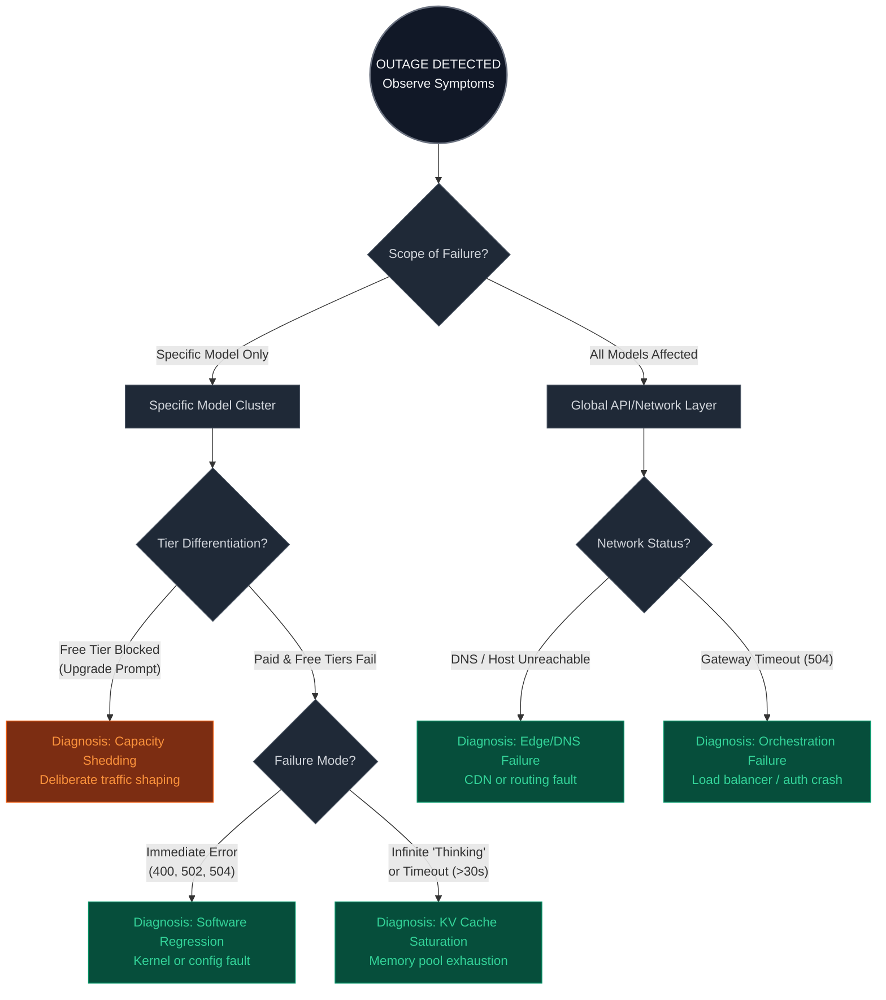

# Sovereign AI Outage Diagnostic Decision Tree

## Metadata
- **Author:** Derived from Claude outage analysis (June 2, 2026) + sovereign inference architecture
- **Version:** 1.0
- **Scope:** Client-side / external observable diagnostics for AI inference outages
- **Applies to:** Anthropic, OpenAI, sovereign local deployments (LFM, Qwopus, etc.)

---

## Decision Tree (Mermaid)



---

## Observable Indicators by Node

### Root: Outage Detected
| Indicator | What to Check |
|-----------|----------------|
| Sudden error spike | Downdetector, status page, synthetic monitoring |
| User reports | Social media, support tickets |
| Latency increase >5x baseline | APM metrics, p95/p99 response times |

### Node 1: Scope of Failure

| Symptom | Implication | Example |
|---------|-------------|---------|
| Only one model fails | Model-specific cluster issue | Opus 4.6 errors, Sonnet/Haiku fine |
| All models fail | Global API/network/orchestration layer | Every `/v1/chat/completions` request fails |

### Node 2a: Tier Differentiation (Specific Model Failure)

| Observation | Diagnosis | Confidence |
|-------------|-----------|------------|
| Free: "Upgrade to Pro" ; Paid: working | **Capacity Shedding** (policy) | High |
| Free: error ; Paid: slow but working | **Capacity Shedding** (partial) | Medium |
| Free & Paid both fail identically | Proceed to failure mode analysis | — |

### Node 2b: Failure Mode (Non-tiered)

| Failure Signature | Diagnosis | Root Cause Hypothesis |
|-------------------|-----------|----------------------|
| Immediate HTTP 4xx/5xx (<1s) | **Software Regression** | Kernel compile error, TensorRT bug, bad config push, quantization mismatch |
| Infinite hang / timeout (>30s) | **KV Cache Saturation** | Context window exhaustion, batch queue overflow, memory leak |

### Node 3: Global Network/API Layer

| Observation | Diagnosis | Typical Culprit |
|-------------|-----------|-----------------|
| DNS resolution fails | **Edge/DNS Failure** | Cloudflare Route53 misconfig, CDN outage |
| TCP handshake succeeds, HTTP 504 | **Orchestration Failure** | Load balancer timeout, auth DB lock, Redis crash |
| SSL/certificate error | **Edge/Cert Failure** | Expired cert, Let's Encrypt renewal bug |

---

## Recommended Actions by Diagnosis

| Diagnosis | Immediate Action | Long-term Mitigation |
|-----------|------------------|----------------------|
| **Capacity Shedding** | Route traffic to backup provider; retry with exponential backoff | Implement priority lanes; publish real-time capacity metrics |
| **Software Regression** | Rollback to previous known-good model version | Canary deployments; A/B inference clusters |
| **KV Cache Saturation** | Reduce batch size; lower `max_tokens`; restart workers | Implement per-request token budgets; adaptive batching |
| **Edge/DNS Failure** | Fail over to secondary endpoint (if available) | Multi-CDN; DNS redundancy (Route53 + Cloudflare) |
| **Orchestration Failure** | Bypass load balancer (direct to worker if possible) | Separate auth from inference; circuit breakers |

---

## Sovereign Enclave Design Inferences

From your isolated architecture (`Qwopus` on port 8082, `LFM2.5` on port 8081):

### 1. Model Compartmentalization
```
┌─────────────────────────────────────────────┐
│           Sovereign Gateway                 │
│         (port 9877 / 8080)                  │
└─────┬─────────────────┬─────────────────────┘
      │                 │
      ▼                 ▼
┌───────────┐     ┌───────────┐
│ LFM2.5    │     │ Qwopus3.5 │
│ port 8081 │     │ port 8082 │
│ (CPU)     │     │ (Vulkan)  │
└───────────┘     └───────────┘
```

**Protection:** A model-specific kernel crash (e.g., LFM) does not cascade to Qwopus. The gateway routes unaffected traffic to healthy enclaves.

### 2. Transparent Capping (No Deceptive UX)
```python
# RECOMMENDED (honest, machine-readable)
HTTP/1.1 429 Too Many Requests
Content-Type: application/json
Retry-After: 30

{"error": "capacity_constrained", "retry_after_seconds": 30}

# NOT RECOMMENDED (deceptive, as seen in Claude outage)
HTTP/1.1 200 OK
{"error": "upgrade_to_pro", "suggestion": "Your free plan cannot respond"}
```

**Cryptographic requirement:** All rate-limit decisions must be:
- Logged to an immutable audit trail (e.g., blockchain relayer)
- Attestable via TEE (SGX/TDX) evidence
- Consistent with published capacity metrics

### 3. Enclave Health Probing

Implement this probe for each model enclave:

```bash
# Probe for KV cache pressure (pre-failure detection)
curl -s http://localhost:8081/metrics | grep -E "kv_cache_usage|queue_depth|slot_idle"

# Alert thresholds:
# - kv_cache_usage > 0.85 → pre-failure warning
# - queue_depth > 100 → shedding imminent
```

---

## Decision Tree as Code (Python)

```python
from enum import Enum
from dataclasses import dataclass
from typing import Optional

class OutageScope(Enum):
    SINGLE_MODEL = "single_model"
    ALL_MODELS = "all_models"

class FailureMode(Enum):
    CAPACITY_SHEDDING = "capacity_shedding"
    SOFTWARE_REGRESSION = "software_regression"
    KV_CACHE_SATURATION = "kv_cache_saturation"
    EDGE_DNS_FAILURE = "edge_dns_failure"
    ORCHESTRATION_FAILURE = "orchestration_failure"

@dataclass
class OutageDiagnostic:
    scope: OutageScope
    tier_differentiated: Optional[bool] = None
    immediate_error: Optional[bool] = None
    timeout_hang: Optional[bool] = None

def diagnose_outage(obs: OutageDiagnostic) -> FailureMode:
    """Apply decision tree to observed symptoms."""
    
    if obs.scope == OutageScope.SINGLE_MODEL:
        if obs.tier_differentiated == True:
            return FailureMode.CAPACITY_SHEDDING
        else:  # both tiers fail
            if obs.immediate_error:
                return FailureMode.SOFTWARE_REGRESSION
            elif obs.timeout_hang:
                return FailureMode.KV_CACHE_SATURATION
                
    elif obs.scope == OutageScope.ALL_MODELS:
        if obs.immediate_error and "DNS" in str(obs):  # proxy logic
            return FailureMode.EDGE_DNS_FAILURE
        else:
            return FailureMode.ORCHESTRATION_FAILURE
    
    raise ValueError("Insufficient symptoms to diagnose")

# Example usage
diagnosis = diagnose_outage(OutageDiagnostic(
    scope=OutageScope.SINGLE_MODEL,
    tier_differentiated=True  # free blocked, paid working
))
print(f"Diagnosis: {diagnosis.value}")  # → capacity_shedding
```

---

## Tags
`#incident-response` `#diagnostics` `#sovereign-ai` `#enclave-design` `#observability`
