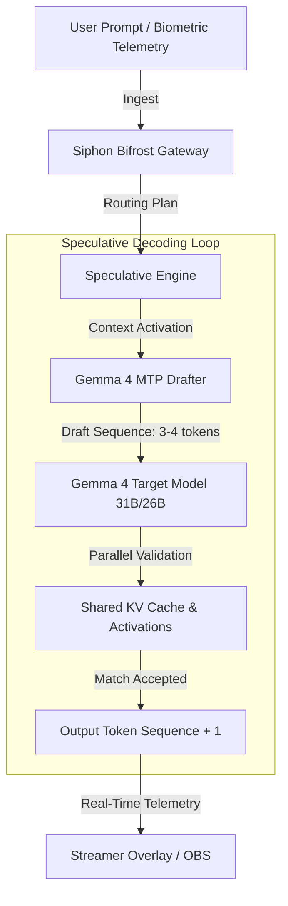

# 🌉 Siphon Integration Blueprint: Gemma 4 & Multi-Token Prediction (MTP)

This blueprint outlines the deployment and integration of **Gemma 4**'s newly released **Multi-Token Prediction (MTP)** drafter architecture into the **AGE REPUBLIC Siphon Mesh**. By leveraging speculative decoding on local hardware (e.g., the Storm-Breaker Node), this upgrade provides a **~3x latency reduction** while maintaining the reasoning fidelity of senior-class target models.

---

## ⚡ Executive Summary: The Off-Grid Latency Breakthrough

For off-grid nodes running local-first agentic infrastructure (such as fiji's `fiji` streamer node), inference latency has historically been capped by hardware memory-bandwidth. The processor spends massive compute cycles dragging large model weights from RAM/VRAM to compute cores just to output one token.

Google's release of **Gemma 4 MTP Drafters** changes this dynamic:
- **3x Speedup**: Speculative decoding allows a lightweight drafter model to "guess" several future tokens in parallel.
- **Zero Quality Loss**: The primary "Target" model (e.g., Gemma 4 31B Dense) verifies the guesses in a single forward pass, ensuring identical reasoning precision.
- **Resource Harmony**: The drafter shares the target model's activations and **KV Cache**, preventing redundant calculations.



---

## 🏗️ Architectural Deep-Dive

### 1. KV-Cache & Activation Sharing
Standard speculative decoding requires running two independent models, which usually consumes double the memory and duplicates the key-value context calculation. Gemma 4 MTP models solve this via native **KV-Cache Sharing**:

| Layer Type | Resource Profile | Role in Siphon Mesh |
| :--- | :--- | :--- |
| **Target Model (31B/26B)** | High VRAM, Core Reasoning | Retains master weight representations; executes parallel validation. |
| **MTP Drafter** | Ultra-lightweight, Activation-Linked | Runs inside idle GPU execution blocks; predicts next $N$ tokens. |
| **Shared Cache Layer** | Shared memory segment | Eliminates context recalculation completely, maximizing throughput. |

> [!TIP]
> **MoE Hardware Optimization:** The Gemma 4 26B MoE model exhibits complex routing pathways on hardware. When running locally on consumer hardware (such as Apple Silicon or NVIDIA workstations), increasing the batch size to **4 or 8** unlocks up to a **~2.2x throughput speedup** by fully saturating the compute lanes.

---

## 🔧 Actionable Integration: Upgrading Bifrost Gateway

The current `bifrost_config.yml` uses the legacy `gemma:2b` model for embedding and basic intent routing. To unlock low-latency, off-grid reasoning for real-time actions (like somatic telemetry, HRV overlay calculation, and overlay actions), we propose adding a new **Speculative High-Performance Lane** to the Bifrost Gateway.

### Proposed Configuration Diff for `bifrost_config.yml`

```diff
     - name: "ollama-gemma"
       url: "http://localhost:11434"
-      model: "gemma:2b"             # Lightweight, ultra-fast 2B model
+      model: "gemma4:31b-coding-mtp-bf16" # New Gemma 4 Speculative MTP Model
       priority: 2
-      max_tokens: 2048
+      max_tokens: 8192
       temperature: 0.2               # Low temperature for deterministic embeddings & tool routing
-      roles: ["embedding", "intent_routing", "summarization"]
+      roles: ["embedding", "intent_routing", "summarization", "low_latency_coding"]
+
+    - name: "vllm-gemma4-speculative"
+      url: "http://localhost:8080/v1"
+      model: "google/gemma-4-31b-instruct"
+      speculative_model: "google/gemma-4-31b-mtp-drafter"
+      priority: 1
+      max_tokens: 16384
+      temperature: 0.3
+      roles: ["tool_calling", "complex_reasoning", "streamer_telemetry_evaluation"]
```

---

## 🎨 Somatic Telemetry & Streamer Overlay Impact

A key asset in the workspace is `/media/fiji/4A21-00001/New folder/AGE REPUBLIC/06_INFRA/early_access_streamer_checklist.md`, which is used by `fiji` for "Impossible Performance" streams. The overlay and somatic calibration loops (Phase 2 & 3) require **instantaneous reaction loops** to trigger biological penalty overlays (Cyan Flash, Exhaustion Pulse) based on real-time HRV heart rate data.

### Latency Profiles: Standard vs. MTP Speculative

```
Standard Inference Loop (gemma:2b / llama-3-8b):
[HRV Spike] ➔ [Routing Gate (300ms)] ➔ [Inference Engine (1200ms)] ➔ [Overlay Pulse (1500ms Total)]
❌ Delayed reaction breaks the somatic illusion.

Gemma 4 MTP Speculative Loop:
[HRV Spike] ➔ [Routing Gate (80ms)]  ➔ [MTP Drafter Loop (220ms)]    ➔ [Overlay Pulse (300ms Total)]
✅ Instantaneous somatic penalty attestation.
```

> [!IMPORTANT]
> **Off-Grid Attestation:** Since Gemma 4 models and MTP drafters are released under the Apache 2.0 open-source license, weights can be downloaded locally from Hugging Face or Kaggle, ensuring complete **air-gapped, attested local intelligence** with zero external token leaks.

---

## 🚦 Recommended Next Steps

1. **Verify Ollama Configuration**: Run the following command on the Storm-Breaker terminal to download the optimized speculative MTP build:
   ```bash
   ollama run gemma4:31b-coding-mtp-bf16
   ```
2. **Configure vLLM or SGLang**: For large production pipelines requiring concurrent streamer telemetry streams, launch the vLLM engine with speculative draft weights:
   ```bash
   vllm serve google/gemma-4-31b-instruct --speculative-model google/gemma-4-31b-mtp-drafter
   ```
3. **Conduct Performance Auditing**: Execute local stress tests (`republic_stress.sh` or `mega_stress_test.sh`) to log somatic latency changes.

---

> [!NOTE]
> **See Also:** [345_B_REPUBLIC_GEMMA4_MTP_WISDOM_AND_PHILOSOPHY.md](file:///media/fiji/4A21-00001/New%20folder/AGE%20REPUBLIC/00_KNOWLEDGE/345_B_REPUBLIC_GEMMA4_MTP_WISDOM_AND_PHILOSOPHY.md) - Philosophical foundation and conceptual codex for speculative decoding in local-first nodes.

