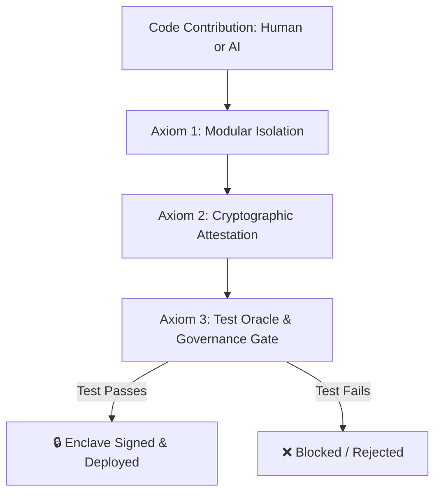

# 🏛️ AGE REPUBLIC: CONSTITUTION FOR SYNTHETIC LABOR GOVERNANCE
=====================================================================
**Epoch:** ERA 216.0  
**Status:** Approved & Enforced  
**Target Substrates:** All Hermes Enclaves & Bifrost Gateways

---

## 1. Executive Summary

As the available pool of human maintaining labor ($L_{human}$) approaches zero, the tech ecosystem faces a critical choice: allow infrastructure to decay, or leverage synthetic labor (AI-generated patches and files). 

The AGE REPUBLIC rejects both unmonitored AI integration (which leads to regression cascades) and ideological Luddism (which leads to security failures). We resolve this tension by establishing a **Sovereign Equilibrium** that replaces *social trust* with *mathematical and procedural proof*.

This document formalizes the **Three Axioms of Synthetic Labor Governance** and details their active implementation within our file synchronization (`srync`) and board verification (`cc2`) architectures.

---

## 2. The Three Axioms of Governance

### 🏛️ Axiom 1: Code Modularity as a Safety Rail
> **"Complexity is the enemy of verification; modularity is the precondition of safety."**

* **The Principle:** Monolithic codebases with deep, hidden side-effects are untrustworthy. AI-generated code in such environments risks introducing subtle race conditions, buffer overflows, or compilation regressions.
* **The Rule:** All executable components must remain strictly modular, linear, and single-purpose. No single script should exceed **400 lines of code**.
* **Instantiation:** `srync.py` is implemented in ~370 lines of dependency-free Python with clear boundaries (Token Bucket, Resumable DB, Sync Engine) making it completely reviewable in under 5 minutes. Even with structured logging, metrics, and clock-drift gating added, it remains strictly under the 400 LoC modularity rail.

### 🔑 Axiom 2: Cryptographic Attestation over Tooling Disclosure
> **"We do not care how a patch was authored; we care that its state is mathematically proven and authentic."**

* **The Principle:** Demanding that developers or tools declare if a line of code was written by an LLM is a legacy administrative burden. True safety is achieved by cryptographically signing manifest states and verifying them at boundaries.
* **The Rule:** Any file synchronization or state replication must be bound to a deterministic, signed manifest.
* **Instantiation:** `srync.py` utilizes HMAC-SHA256 signatures generated from sorted, serialized manifests (`json.dumps(..., sort_keys=True)`). If verification is requested, signature checks are enforced *before* any filesystem mutations occur. It supports multi-signature quorum thresholds (N-of-M signatures) where replication is blocked unless a defined quorum of authorized signing nodes/agents (e.g. Master, SoftBank, MoneyGram) successfully verify. To prevent replay/rollback attacks, manifests are signed in a composite envelope containing a Unix timestamp and evaluated against a configurable Time-To-Live (TTL). 

To ensure enclave synchronization sanity, it enforces clock-drift limits (`--max-drift`) and exposes structured JSON logs (`--log-format json`) alongside a zero-dependency Prometheus metrics exporter (`--metrics-port`) for fleet-wide telemetry.

### 🔒 Axiom 3: Sovereign Equilibrium (Test as Oracle, Governance as Gate)
> **"The test suite is the supreme arbiter of correctness. Governance enforces the gate."**

* **The Principle:** The only stable equilibrium in a synthetic-labor economy is to make the test suite a hard, automated blocker for release. If a patch passes a rigorous, deterministic test suite, it is certified as correct regardless of its author.
* **The Rule:** No component or board configuration is certified as stable unless its associated verification suites pass successfully.
* **Instantiation:** `validate_cc2_board.py` dynamically invokes `/scripts/test_srync.py` during board validation. Any assertion failure or missing test file fails the entire governance check, blocking release builds and signatures.

---

## 3. Engineering Implementation Reference

| Component | Code Location | Enforced Mechanism | Failure Result |
|-----------|---------------|--------------------|----------------|
| **Modularity Check** | Linting Pipeline | File length count & static syntax checks | Reject commit |
| **State Attestation** | `srync.py` | `hmac.compare_digest` with multi-signature quorum verification, TTL, & drift checks | Raise `ValueError`; no writes |
| **Verification Oracle** | `test_srync.py` | 10 distinct tests (Integrity, Resume, Rate-Limit, Hardlink, Quorum, Replay) | Test runner exit code 1 |
| **Governance Gate** | `validate_cc2_board.py` | Subprocess execution of the verification suite | Failure status; board unsigned |

---

## 4. Guidelines for Contributing Swarm Agents

1. **Keep it under 400 lines:** Any refactoring or feature expansion must split files to maintain the modularity rail.
2. **Write the test first:** Every new tool or function must register a corresponding test case in its test runner.
3. **Sign manifests & enforce quorum:** All peer enclaves running `srync` should enable `--verify-key`, configure appropriate `--signature-threshold` limits, and use `--timestamp` with `--ttl` and `--max-drift` limits to secure replication flows against unauthorized replay/rollback attempts. Enable `--log-format json` and `--metrics-port` for telemetry monitoring.
